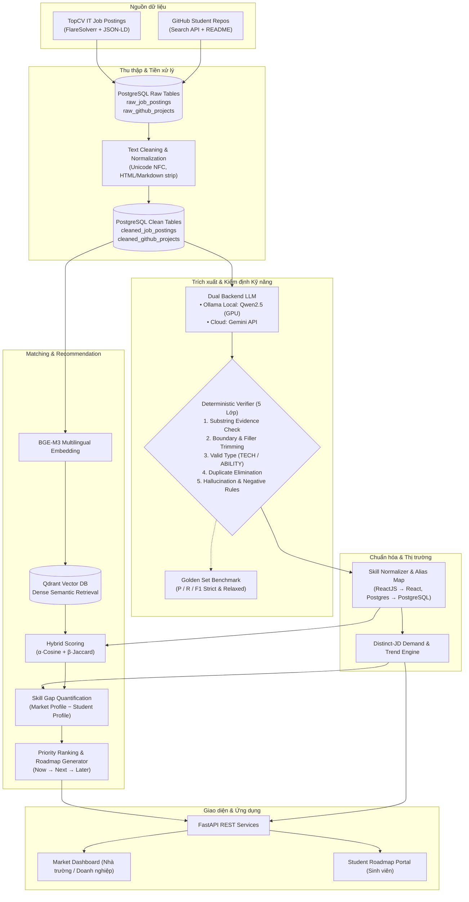

# 💎 GEM (LUSTRA_GEM) — AI Skill Intelligence & Tech Roadmap Platform

<p align="center">
  
</p>

<p align="center">
  <b>Nền tảng AI định hướng & khớp nối năng lực Đồ án CNTT với xu hướng tuyển dụng thực tế</b><br>
  <i>AISC 2026 · Track: Data Driven Business · Team LUSTRA (UIT)</i>
</p>

<p align="center">
  
  
  
  
  
  
  
  
</p>

---

## 📌 Mục lục

- [1. Giới thiệu tổng quan](#-1-giới-thiệu-tổng-quan)
- [2. Điểm nổi bật & Giá trị cốt lõi](#-2-điểm-nổi-bật--giá-trị-cốt-lõi)
- [3. Kiến trúc hệ thống & Luồng dữ liệu](#-3-kiến-trúc-hệ-thống--luồng-dữ-liệu)
- [4. Pipeline End-to-End](#-4-pipeline-end-to-end)
- [5. Cấu trúc dự án](#-5-cấu-trúc-dự-án)
- [6. Công nghệ & Hạ tầng](#-6-công-nghệ--hạ-tầng)
- [7. Hướng dẫn cài đặt & Khởi chạy](#-7-hướng-dẫn-cài-đặt--khởi-chạy)
- [8. Tiến độ dự án](#-8-tiến-độ-dự-án)
- [9. Đội ngũ phát triển](#-9-đội-ngũ-phát-triển)

---

## 📖 1. Giới thiệu tổng quan

Trong đào tạo CNTT, sinh viên thường gặp khoảng cách lớn giữa **những gì thực sự xây dựng trong đồ án** và **những gì thị trường tuyển dụng yêu cầu**:
- Chọn công nghệ theo cảm tính hoặc tutorial ngắn hạn, thiếu tính cập nhật với thị trường.
- Đồ án có hàm lượng học thuật tốt nhưng thiếu các kỹ năng thực chiến (DevOps, Cloud, CSDL, Design Patterns) mà doanh nghiệp tìm kiếm.
- Chưa có công cụ định lượng khoảng cách kỹ năng (Skill Gap) dựa trên bằng chứng kỹ thuật (evidence-based) và đề xuất lộ trình công nghệ (Tech Roadmap) rõ ràng.

**GEM (LUSTRA_GEM)** ra đời nhằm giải quyết triệt để bài toán này:
> **Định vị cốt lõi:** GEM kết nối *"thị trường đang cần gì"* (dữ liệu tuyển dụng TopCV) với *"sinh viên đang làm được gì"* (dự án thực tế trên GitHub), định lượng khoảng cách kỹ năng bằng AI và chuyển khoảng cách đó thành một lộ trình học tập có thể giải thích, truy vết được bằng chứng.

---

## 🌟 2. Điểm nổi bật & Giá trị cốt lõi

1. **Bằng chứng thực tế (Evidence-based Extraction):** Kỹ năng trích xuất luôn gắn liền với đoạn văn bản gốc (`evidence`), vị trí ký tự (`span offsets`), không chấp nhận kỹ năng "suy diễn" ngoài văn bản.
2. **Bộ kiểm định tất định 5 lớp (5-Layer Deterministic Verifier):** Loại bỏ hoàn toàn ảo giác (hallucination), cắt lọc từ thừa (filler trimming), chuẩn hóa phân loại (`TECHNOLOGY` vs `ABILITY`), và thực thi các quy tắc loại trừ nghiêm ngặt (chức danh, tên công ty, đãi ngộ).
3. **Phân tích nhu cầu đa chiều (Distinct-JD Demand & Trend):** Đo lường nhu cầu theo số lượng tin tuyển dụng độc lập (không đếm số lần lặp từ khóa đơn thuần), theo dõi xu hướng biến động theo thời gian.
4. **Khớp nối lai (Hybrid Matching):** Kết hợp độ tương đồng ngữ nghĩa sâu (Dense Cosine Similarity từ BGE-M3) và độ giao thoa kỹ năng thực tế (Jaccard Similarity trên Canonical Skills).
5. **Định hướng lộ trình có giải thích (Explainable Tech Roadmap):** Xếp hạng ưu tiên dựa trên `Gap × Demand × Trend`, phân nhóm `Now → Next → Later` với lý do minh bạch cho từng sinh viên.

---

## 🏗️ 3. Kiến trúc hệ thống & Luồng dữ liệu



---

## ⚡ 4. Pipeline End-to-End

| Giai đoạn | Mô tả kỹ thuật | Trạng thái |
|---|---|:---:|
| **Stage 0: Ingestion** | Airflow DAGs điều phối thu thập định kỳ từ TopCV (vượt Cloudflare bằng FlareSolverr) và GitHub Search API. | ✅ Hoàn thành (700+ JD, 292+ Repo) |
| **Stage 1: Cleaning** | Làm sạch text chuyên sâu: giữ dấu tiếng Việt (NFC), bóc tách phần yêu cầu công việc, lọc badge/link README, dedup bằng URL & content hash. | ✅ Hoàn thành (`cleaned_*` tables) |
| **Stage 2: Extraction** | Prompt kỹ thuật song ngữ + Few-shot trích xuất `{evidence, type}` với 2 nhãn chính: `TECHNOLOGY` và `ABILITY`. Hỗ trợ chạy local bằng Qwen2.5 qua Ollama hoặc Gemini API. | ✅ Hoàn thành (`SkillExtractor`) |
| **Stage 3: Verification** | Bộ kiểm định tất định 5 lớp tự động dò offset, cắt từ thừa, loại bỏ ảo giác, loại chức danh/đãi ngộ/soft skills. | ✅ Hoàn thành (`verifier.py`) |
| **Stage 4: Evaluation** | Benchmark đối sánh hiệu năng E1 trên Gold Set (đo Strict/Relaxed Precision, Recall, F1, Hallucination Rate). | ✅ Hoàn thành (`evaluator.py`, `run_extraction_benchmark.py`) |
| **Stage 5: Normalization** | Chuẩn hóa các biến thể chính tả về `canonical_skill` chuẩn (ví dụ: `ReactJS`, `react.js` $\rightarrow$ `React`). | 🟡 Đang hoàn thiện |
| **Stage 6: Market Intelligence** | Thống kê Demand theo tỉ lệ Distinct-JD và tính độ dốc biến động xu hướng (Trend). | 🟡 Đang hoàn thiện |
| **Stage 7: Semantic Indexing** | Mã hóa ngữ nghĩa đa ngôn ngữ BGE-M3, lưu trữ vector trong Qdrant. | 🟡 Đang triển khai |
| **Stage 8: Hybrid Matching & Gap** | Kết hợp Cosine Similarity và Jaccard Skill Overlap để xác định khoảng cách năng lực đồ án. | ⏳ Chuẩn bị triển khai |
| **Stage 9: Roadmap Engine** | Xếp hạng ưu tiên theo `Gap × Demand × Trend`, tạo lộ trình học tập cá nhân hóa kèm bằng chứng giải thích. | ⏳ Chuẩn bị triển khai |

---

## 📂 5. Cấu trúc dự án

```text
AISC26_LUSTRA_GEM/
├── backend/                        # FastAPI REST API Backend
│   └── app/
│       ├── api/routes/             # Endpoints: jobs, projects, skills, recommendations
│       ├── core/                   # Cấu hình hệ thống, logging, bảo mật
│       ├── models/                 # SQLAlchemy / Pydantic models
│       └── services/               # Nghiệp vụ matching, roadmap, market
├── pipeline/                       # Data Engineering & AI Pipelines
│   ├── dags/                       # Airflow DAGs (Orchestration mỏng)
│   │   ├── topcv_dag.py            # DAG cào tin tuyển dụng TopCV
│   │   └── github_dag.py           # DAG cào dự án sinh viên GitHub
│   └── src/gem_pipeline/           # Toàn bộ mã nguồn nghiệp vụ chính
│       ├── ingestion/              # Module thu thập TopCV & GitHub
│       ├── cleaning/               # job_cleaner.py & project_cleaner.py
│       ├── extraction/             # prompts.py, extractor.py, verifier.py
│       ├── golden_set/             # evaluator.py & công cụ đánh giá nhãn vàng
│       ├── normalization/          # Canonical skills & alias dictionaries
│       ├── market/                 # Demand calculation & trend analyzer
│       ├── matching/               # Cosine, Jaccard & Hybrid matching
│       └── recommendation/         # Gap quantification & Roadmap builder
├── frontend/                       # React 18 + TypeScript + Vite
│   └── src/
│       ├── components/             # UI components, biểu đồ, bảng kỹ năng
│       ├── pages/                  # Dashboard thị trường, Hồ sơ sinh viên, Roadmap
│       └── services/               # API clients kết nối backend
├── data/                           # Quản lý dữ liệu phân tầng
│   ├── raw/                        # Dữ liệu thu thập thô
│   ├── processed/                  # Dữ liệu đã làm sạch & trích xuất
│   └── gold/                       # Golden Set nhãn vàng & kết quả benchmark E1
├── docs/                           # Tài liệu thiết kế & Thuyết minh đề tài
│   ├── GEM_Thuyet_Minh_De_Tai.md   # Thuyết minh đề tài chi tiết v0.2
│   └── annotation/                 # GEM_Annotation_Guideline_v1.0.md
├── infra/                          # Hạ tầng Docker & Điều phối dịch vụ
│   └── docker-compose.yml          # PostgreSQL, Qdrant, FlareSolverr, Airflow
├── scripts/                        # Các script thực thi & tiện ích dòng lệnh
│   ├── generate_golden_set.py      # Tạo bộ nháp Golden Set xuất file Excel
│   ├── run_extraction_benchmark.py # Chạy thực nghiệm đối sánh E1
│   ├── test_qwen_local.py          # Kiểm tra mô hình Qwen local với GPU
│   └── move_pagefile_to_D.bat      # Tiện ích tối ưu bộ nhớ đệm ổ đĩa
├── .env.example                    # Mẫu cấu hình môi trường bảo mật
└── README.md                       # Tài liệu tổng quan dự án
```

---

## 🛠️ 6. Công nghệ & Hạ tầng

| Lớp kiến trúc | Công nghệ sử dụng | Vai trò trong hệ thống |
|---|---|---|
| **Data Ingestion** | BeautifulSoup4, Requests, FlareSolverr, GitHub REST API | Thu thập dữ liệu JD (vượt bảo vệ Cloudflare) và README dự án sinh viên |
| **Orchestration** | Apache Airflow 2.7+ (LocalExecutor) | Lập lịch, theo dõi và tự động hóa các tác vụ cào dữ liệu hằng ngày |
| **Primary Storage** | PostgreSQL 15 | Cơ sở dữ liệu quan hệ lưu trữ dữ liệu thô, dữ liệu sạch và metadata kỹ năng |
| **Vector Storage** | Qdrant Vector Database | Lưu trữ vector embedding và thực hiện tìm kiếm tương đồng ngữ nghĩa |
| **Local LLM Engine** | Ollama, Qwen2.5 (3B / 7B) | Trích xuất kỹ năng cục bộ trên GPU NVIDIA RTX (CUDA 13.0) không phụ thuộc API cloud |
| **Cloud AI Fallback**| Google Gemini 3.5 Flash-Lite / 3.8 Flash | Dự phòng trích xuất khi hệ thống cần mở rộng throughput cao |
| **Embedding Model**  | BAAI/bge-m3 | Mô hình embedding đa ngôn ngữ hỗ trợ tiếng Việt và tiếng Anh |
| **Backend API**      | FastAPI, Pydantic, SQLAlchemy | Cung cấp RESTful API hiệu năng cao cho giao diện người dùng |
| **Frontend Web**     | React, TypeScript, TailwindCSS / Vanilla CSS, Vite | Giao diện tương tác sinh viên và Dashboard phân tích thị trường |
| **Containerization** | Docker, Docker Compose | Đóng gói và chuẩn hóa môi trường triển khai cho toàn bộ dịch vụ |

---

## 🚀 7. Hướng dẫn cài đặt & Khởi chạy

### 1. Chuẩn bị môi trường

Yêu cầu hệ thống:
- Hệ điều hành: Windows (WSL2), Ubuntu, hoặc macOS.
- **Python:** 3.11 hoặc 3.12.
- **Docker Desktop** (hoặc Docker Engine + Docker Compose).
- Card đồ họa NVIDIA (khuyến nghị nếu muốn chạy LLM Qwen cục bộ) hoặc API Key Gemini.

### 2. Clone repository & Tạo môi trường ảo

```bash
git clone https://github.com/PoemN-1212/AISC26_LUSTRA_GEM.git
cd AISC26_LUSTRA_GEM

# Tạo và kích hoạt môi trường ảo Python
python -m venv .venv
# Trên Windows PowerShell:
.\.venv\Scripts\Activate.ps1
# Trên Linux/macOS:
source .venv/bin/activate

# Cài đặt các gói phụ thuộc
pip install -r pipeline/requirements.txt
```

### 3. Cấu hình biến môi trường

Sao chép file cấu hình mẫu và điền các thông số:
```bash
cp .env.example .env
```
Cấu hình các thông số cơ bản trong `.env`:
```env
POSTGRES_USER=gem_admin
POSTGRES_PASSWORD=gem_secret_password
POSTGRES_DB=gem_database
POSTGRES_PORT=5432
QDRANT_PORT=6333
GEMINI_API_KEY=your_gemini_api_key_here
```

### 4. Khởi động hạ tầng với Docker Compose

```bash
cd infra
docker-compose --env-file ../.env up -d
```
Kiểm tra các container đang chạy:
```bash
docker compose ps
```
- Airflow Webserver: [http://localhost:8080](http://localhost:8080)
- Qdrant Dashboard: [http://localhost:6333/dashboard](http://localhost:6333/dashboard)

### 5. Chạy mô hình trích xuất cục bộ (Tùy chọn)

Để chạy trích xuất hoàn toàn miễn phí không qua Cloud API:
1. Cài đặt [Ollama](https://ollama.com).
2. Tải mô hình Qwen 2.5:
   ```bash
   ollama pull qwen2.5:3b
   ```
3. Chạy thử nghiệm trích xuất:
   ```bash
   python scripts/test_qwen_local.py
   ```

### 6. Chạy Benchmark Đối sánh Hiệu năng E1

```bash
python scripts/run_extraction_benchmark.py
```
Kết quả đo lường định lượng (Strict/Relaxed Precision, Recall, F1) sẽ được in trực tiếp trên terminal và lưu vào `data/gold/benchmark_e1_results.json`.

---

## 📈 8. Tiến độ dự án

- [x] **Phase 0:** Xác định đề tài, kiến trúc hệ thống, dựng hạ tầng Docker (Postgres, Qdrant, FlareSolverr, Airflow).
- [x] **Phase 1 (Data):** Hoàn thành cào dữ liệu TopCV (700+ JD) và GitHub (292+ Repo), hoàn thiện pipeline làm sạch dữ liệu.
- [x] **Phase 2 (Extraction & Verifier):**
  - [x] Ban hành hướng dẫn gán nhãn [GEM Annotation Guideline v1.0](docs/annotation/GEM_Annotation_Guideline_v1.0.md).
  - [x] Xây dựng bộ kiểm định tất định 5 lớp (`verifier.py`).
  - [x] Hỗ trợ Dual-Backend LLM (Qwen2.5 Local GPU + Gemini API).
  - [x] Xây dựng bộ công cụ tạo nhãn vàng và Evaluator định lượng P/R/F1.
- [ ] **Phase 3 (Normalization & Market):** Xây dựng Canonical Skill Dictionary, tính toán Demand và Trend theo Distinct-JD.
- [ ] **Phase 4 (Matching & Semantic Indexing):** Tích hợp BGE-M3 + Qdrant, thuật toán Hybrid Matching.
- [ ] **Phase 5 (Roadmap & Products):** Hoàn thiện Backend FastAPI, Giao diện React Frontend và kịch bản Demo người dùng.

---

## 👥 9. Đội ngũ phát triển

**Cuộc thi:** Advanced Information Systems Contest 2026 (AISC 2026)  
**Đơn vị:** Trường Đại học Công nghệ Thông tin — ĐHQG-HCM (UIT)  
**Khoa:** Hệ thống Thông tin  
**Nhóm:** LUSTRA

| Thành viên | MSSV | Vai trò chính |
|---|:---:|---|
| **Lê Vĩnh Thái** | 23521417 | Team Lead · Data Engineer & AI Pipeline Architect |
| **Nguyễn Văn Mạnh Huy** | 23520641 | AI Engineer · Model Evaluation & Normalization |
| **Trần Nhụy Tam Tử Phục** | 24521400 | Backend Developer · Data Ingestion & API |
| **Phạm Nhật Khoa** | 23520753 | Frontend Developer · UI/UX & Visualization |

---

<p align="center">
  <b>💎 GEM × LUSTRA</b><br>
  <i>Empowering IT Students with Market-Driven Skill Intelligence</i>
</p>
