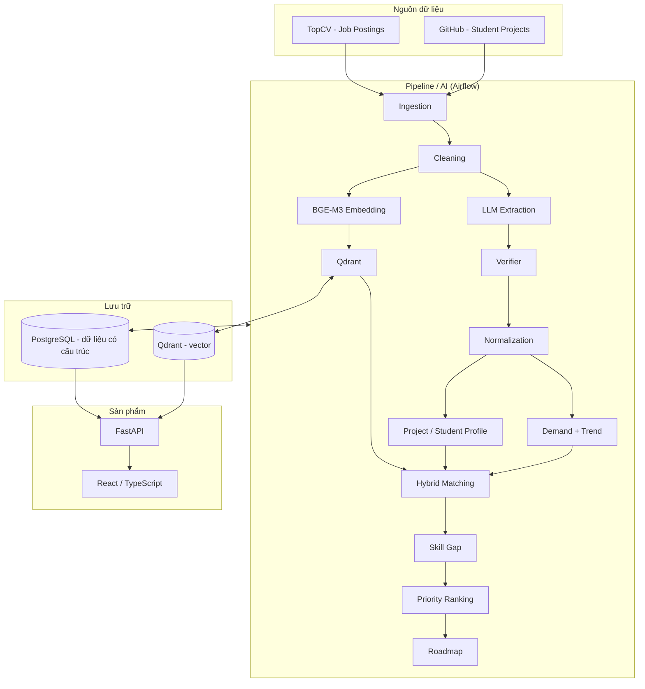
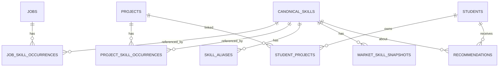

# THUYẾT MINH ĐỀ TÀI — GEM (LUSTRA_GEM)

## Hệ thống phân tích kỹ năng thị trường IT, đo khoảng cách kỹ năng sinh viên và đề xuất lộ trình công nghệ

| | |
|---|---|
| **Cuộc thi** | AISC 2026 — Data Driven Business |
| **Đơn vị** | Trường ĐH Công nghệ Thông tin — ĐHQG-HCM (UIT), Khoa Hệ thống Thông tin |
| **Nhóm** | LUSTRA — Lê Vĩnh Thái (Team Lead / Data Engineer), Nguyễn Văn Mạnh Huy, Trần Nhụy Tam Tử Phục, Phạm Nhật Khoa |
| **Phiên bản tài liệu** | v0.2 — 2026-10-08 |
| **Trạng thái dự án** | Hoàn thành Phase 1 (Data) & Phase 2 (Extraction + Verifier + Evaluator); Chuẩn bị Phase 3 (Normalization & Market) — xem [§14](#14-kế-hoạch-thực-hiện-và-tiến-độ) |

> **Quy ước nhãn trong tài liệu**
>
> - 🔒 **ĐÃ CHỐT** — team đã thống nhất.
> - 💡 **KHUYẾN NGHỊ** — phương án đề xuất, có thể điều chỉnh khi làm.
> - 🧩 **TÙY CHỌN / TƯƠNG LAI** — không bắt buộc cho MVP.
> - ❓ **CHƯA CHỐT** — chưa được coi là quyết định cuối.
>
> Mọi con số ví dụ trong tài liệu (demand %, P/R/F1...) đều là **minh họa**, không phải kết quả thực tế của GEM.

---

## Mục lục

1. [Tóm tắt đề tài](#1-tóm-tắt-đề-tài)
2. [Bối cảnh và vấn đề](#2-bối-cảnh-và-vấn-đề)
3. [Mục tiêu, câu hỏi nghiên cứu, giả thuyết](#3-mục-tiêu-câu-hỏi-nghiên-cứu-giả-thuyết)
4. [Phạm vi MVP](#4-phạm-vi-mvp)
5. [Dữ liệu](#5-dữ-liệu)
6. [Kiến trúc tổng thể](#6-kiến-trúc-tổng-thể)
7. [Pipeline end-to-end chi tiết](#7-pipeline-end-to-end-chi-tiết)
8. [Mô hình dữ liệu](#8-mô-hình-dữ-liệu)
9. [Backend API](#9-backend-api)
10. [Frontend](#10-frontend)
11. [Đánh giá và thực nghiệm](#11-đánh-giá-và-thực-nghiệm)
12. [Hạ tầng và tổ chức mã nguồn](#12-hạ-tầng-và-tổ-chức-mã-nguồn)
13. [Hạn chế, đạo đức, cách diễn giải](#13-hạn-chế-đạo-đức-cách-diễn-giải)
14. [Kế hoạch thực hiện và tiến độ](#14-kế-hoạch-thực-hiện-và-tiến-độ)
15. [Sổ quyết định](#15-sổ-quyết-định)
16. [Rủi ro và phương án](#16-rủi-ro-và-phương-án)
17. [Phụ lục](#17-phụ-lục)

---

## 1. Tóm tắt đề tài

**GEM** là hệ thống dữ liệu và AI dùng **tin tuyển dụng IT thực tế (TopCV)** và **dự án của sinh viên (GitHub)** để:

1. trích xuất kỹ năng từ tin tuyển dụng và README dự án;
2. chuẩn hóa các cách viết khác nhau của cùng một kỹ năng về **canonical skill**;
3. đo **nhu cầu (demand)** và **xu hướng (trend)** của từng kỹ năng trên mẫu thị trường;
4. dựng **hồ sơ kỹ năng có bằng chứng** từ dự án của sinh viên;
5. so khớp hồ sơ với thị trường, tìm **khoảng cách kỹ năng (skill gap)**;
6. xếp **ưu tiên** và sinh **lộ trình học công nghệ (roadmap)** có giải thích.

> **Câu mô tả chuẩn:** GEM kết nối *"thị trường đang cần gì"* với *"sinh viên đang xây dựng được gì"*, định lượng khoảng cách kỹ năng và chuyển khoảng cách đó thành một lộ trình học công nghệ có thể giải thích và truy ngược về bằng chứng.

**Đóng góp chính** không nằm ở một mô hình mới, mà ở **chuỗi liên kết end-to-end có bằng chứng**:

```text
Market (TopCV) → Skill → Demand + Trend ─┐
                                         ├─→ Match → Gap → Priority → Roadmap
Student (GitHub) → Skill → Profile ──────┘
                 (điểm nối chung: CANONICAL SKILL)
```

---

## 2. Bối cảnh và vấn đề

### 2.1 Vấn đề thực tế

Sinh viên IT thường có khoảng cách giữa *những gì học* → *những gì thực sự xây dựng trong đồ án* → *những gì doanh nghiệp yêu cầu*:

- Chọn công nghệ cho đồ án theo thói quen hoặc tutorial, không biết thị trường có cần không.
- Đồ án tốt về học thuật nhưng thiếu công nghệ thường gặp trong JD.
- CV liệt kê nhiều skill nhưng không có bằng chứng trong dự án.
- Sinh viên không chỉ cần "danh sách skill", mà cần biết **thiếu gì, quan trọng ra sao, vì sao, học cái nào trước**.

### 2.2 Khó khăn kỹ thuật

- JD viết rất không đồng nhất: `React / ReactJS / React.js`, `Postgres / PostgreSQL / pgsql`, `REST API / RESTful API`.
- JD trên TopCV **phần lớn là tiếng Việt**, thường **trộn Việt–Anh**; README GitHub có thể **100% tiếng Anh**.
- Đếm số lần xuất hiện của từ khóa ≠ nhu cầu tuyển dụng (một JD có thể lặp một skill 10 lần).
- LLM có thể bịa skill không có trong văn bản (hallucination).

### 2.3 Cách làm quá đơn giản mà GEM **không** làm

```text
Crawl job → đếm keyword → sort → bảo sinh viên học top keyword
```

Thiếu: chuẩn hóa alias, đếm theo JD, ngữ cảnh, hồ sơ sinh viên, gap, trend, giải thích.

### 2.4 Phát biểu bài toán

> Với hồ sơ dự án/kỹ năng hiện tại của một sinh viên và với nhu cầu của thị trường (hoặc nhóm công việc liên quan), **những kỹ năng quan trọng nào đang thiếu, thiếu ở mức nào, vì sao quan trọng, và nên học theo thứ tự nào?**

---

## 3. Mục tiêu, câu hỏi nghiên cứu, giả thuyết

### 3.1 Mục tiêu

| # | Mục tiêu |
|---|---|
| O1 | Thu thập định kỳ JD IT (TopCV) và dự án sinh viên (GitHub). |
| O2 | Trích xuất tự động kỹ năng loại TECHNOLOGY và ABILITY, có evidence gốc, **ưu tiên tiếng Việt**. |
| O3 | Kiểm soát extraction bằng verifier trước khi đưa vào thống kê. |
| O4 | Chuẩn hóa skill về canonical skill. |
| O5 | Tính demand theo số JD khác nhau và trend theo thời gian. |
| O6 | Dựng hồ sơ kỹ năng dự án/sinh viên có bằng chứng truy ngược được. |
| O7 | So khớp, tính gap, xếp ưu tiên, sinh roadmap có giải thích. |
| O8 | Cung cấp API + giao diện web cho sinh viên (và dashboard thị trường). |
| O9 | Đánh giá định lượng extraction trên Gold Set. |

### 3.2 Câu hỏi nghiên cứu

- **RQ1** — LLM trích xuất TECHNOLOGY và ABILITY từ JD IT (chủ yếu tiếng Việt / song ngữ) chính xác đến mức nào?
- **RQ2** — Verifier cải thiện precision và giảm extraction không có căn cứ đến mức nào?
- **RQ3** — Demand theo số JD khác nhau có ý nghĩa hơn đếm số lần xuất hiện không?
- **RQ4** — Kết hợp market profile và student project profile để xác định skill gap như thế nào?
- **RQ5** — Matching kết hợp ngữ nghĩa (cosine) + ký hiệu (Jaccard) có cho kết quả ổn định/dễ giải thích hơn embedding-only không?

### 3.3 Giả thuyết (chỉ là giả thuyết cho tới khi có kết quả)

- **H1** — Qwen + Verifier có precision cao hơn Qwen-only và giảm hallucination.
- **H2** — Distinct-JD aggregation phản ánh demand tốt hơn raw mention count.
- **H3** — Hybrid matching tốt hơn chỉ cosine hoặc chỉ Jaccard.
- **H4** — Gap + Demand + Trend cho thứ tự ưu tiên hữu ích hơn chỉ Gap.

---

## 4. Phạm vi MVP

### 4.1 Trong phạm vi 🔒

| Nhóm | Thành phần |
|---|---|
| Dữ liệu | TopCV crawler, GitHub crawler, PostgreSQL, raw + cleaned |
| AI/NLP | LLM skill extraction (Qwen là mục tiêu), verifier, normalization |
| Thị trường | Demand theo distinct JD, trend theo thời gian |
| Sinh viên | Trích xuất skill từ dự án, hồ sơ skill dự án/sinh viên |
| Ngữ nghĩa | BGE-M3 embedding, Qdrant |
| Matching | Cosine, Jaccard, hybrid |
| Gợi ý | Skill gap, priority ranking, technology roadmap |
| Sản phẩm | FastAPI backend, React/TypeScript frontend, dashboard |
| Đánh giá | Annotation guideline, Gold Set, Precision/Recall/F1, vài thực nghiệm nhỏ |

### 4.2 Ngoài phạm vi MVP 🔒

- Nhiều kiến trúc extraction song song; pretrain/fine-tune JobBERT/SpanBERT.
- Gán nhãn tay hàng nghìn JD.
- Graph recommendation phức tạp, learning-to-rank.
- RAG ở mọi tầng.
- Nested / overlapping span.
- Mô hình trình độ Beginner/Intermediate/Advanced.
- Tối ưu chương trình đào tạo toàn trường.

---

## 5. Dữ liệu

### 5.1 Nguồn 1 — TopCV (thị trường muốn gì)

- **Phương pháp thu thập:** FlareSolverr (vượt Cloudflare) + BeautifulSoup, bóc tách khối **JSON-LD `JobPosting`** trong trang chi tiết.
- **Phạm vi:** danh mục "Công nghệ thông tin" (`cr257`), tối đa 70 trang danh sách, dừng sớm khi trang không còn tin mới.
- **Lịch:** DAG `gem_topcv_daily_crawler`, 07:00 hằng ngày.
- **Bảng hiện tại:** `raw_job_postings`

| Cột | Ghi chú |
|---|---|
| `id` | SERIAL |
| `url` | UNIQUE — khóa dedup |
| `title`, `company` | từ JSON-LD |
| `salary_min`, `salary_max` | từ `baseSalary` |
| `full_content` | mô tả **đã strip HTML** |
| `scraped_at` | thời điểm cào |

- **Hiện trạng:** ✅ Đã cào được **hơn 700 JD** (lưu trong `raw_job_postings` và đã làm sạch qua pipeline lưu tại `cleaned_job_postings`).
- **Thiếu, sẽ bổ sung ở vòng 2:** raw HTML/JSON-LD gốc, `datePosted` (bắt buộc cho trend), `external_id`, `location`, `content_hash`, `last_seen_at`; xử lý lương "Thỏa thuận".

### 5.2 Nguồn 2 — GitHub (sinh viên xây gì)

- **Phương pháp:** GitHub Search API + API README (base64).
- **Truy vấn:** `"đồ án tốt nghiệp"`, `"capstone project"`, `"khóa luận tốt nghiệp"` trong README/description; 5 trang × 30 repo / truy vấn.
- **Lịch:** DAG `gem_github_projects_crawler`, 08:00 hằng ngày.
- **Lưu trữ:** ghi đồng thời **Postgres local** (để xem/kiểm tra trước) và **Neon cloud** (chia sẻ cho team) — lựa chọn có chủ đích ở giai đoạn này.
- **Bảng hiện tại:** `raw_github_projects` — `repo_url` (UNIQUE), `repo_name`, `author`, `description`, `readme_content`, `language`, `stars`, `created_at`, `scraped_at`.
- **Hiện trạng:** ✅ Đã cào được **hơn 292 dự án** (lưu trong `raw_github_projects` và đã làm sạch tại `cleaned_github_projects`).
- **Thiếu, bổ sung sau:** `repository_id`, `topics`, `updated_at`, thống kê ngôn ngữ, file manifest (`package.json`, `requirements.txt`, `Dockerfile`...).

> **Cách diễn giải đúng:** GitHub cho *"có bằng chứng kỹ thuật liên quan đến skill X trong project Y"*, **không** chứng minh *"sinh viên thành thạo X"*.

### 5.3 Gold Set

- Tập nhỏ JD được người gán nhãn theo guideline của GEM; dùng để định nghĩa "đúng", đánh giá extraction, so sánh phiên bản, cải thiện prompt.
- **Không** phải nhãn production cho toàn bộ dữ liệu.
- **Quy trình đã chốt 🔒:** dùng LLM gán nhãn trước (pre-annotation) → chạy hết vòng pipeline → **sau đó mới gán nhãn thủ công**.
- 💡 Khi gán nhãn tay: người gán phải được **thêm** span LLM bỏ sót (không chỉ tick đúng/sai), để Recall không bị thổi phồng.
- 💡 Quy mô khoảng 100–150 JD; tách ~20–30 JD làm tập chỉnh prompt (dev), phần còn lại giữ cố định làm tập đánh giá (test).
- **Hiện trạng:** ✅ Đã ban hành hướng dẫn gán nhãn chuẩn [`docs/annotation/GEM_Annotation_Guideline_v1.0.md`](annotation/GEM_Annotation_Guideline_v1.0.md) với schema `{evidence, type}` (`TECHNOLOGY`, `ABILITY`), ranh giới span tối thiểu và tiêu chuẩn khớp Strict/Relaxed. Script [`scripts/generate_golden_set.py`](../scripts/generate_golden_set.py) đã cập nhật kết nối database trực tiếp lấy mẫu từ `cleaned_job_postings` và `cleaned_github_projects`, tự động gọi LLM trích xuất bản nháp và xuất file Excel nghiệm thu [`data/gold/annotations/GEM_Golden_Set_Draft.xlsx`](../data/gold/annotations/GEM_Golden_Set_Draft.xlsx) với các cột kiểm định thực tế (`human_verify`, `human_corrected_skill`, `missing_skills_added`...).

### 5.4 Chiến lược ngôn ngữ 🔒

- **Tiếng Việt là ngôn ngữ chính** của hệ thống.
- Phải xử lý được: JD tiếng Việt, JD trộn Việt–Anh, README 100% tiếng Anh.
- Hệ quả:
  - Cleaning **không được bỏ dấu** tiếng Việt; chỉ Unicode-normalize (NFC).
  - Guideline + prompt phải có ví dụ tiếng Việt.
  - Danh sách "filler" phải có cả tiếng Việt: *có kinh nghiệm, thành thạo, hiểu biết về, ưu tiên ứng viên biết, nắm vững...*
  - Embedding dùng mô hình đa ngôn ngữ (BGE-M3).
  - Tên công nghệ (TECHNOLOGY) thường giữ nguyên tiếng Anh dù câu tiếng Việt → thuận lợi cho chuẩn hóa.

---

## 6. Kiến trúc tổng thể



**Nguyên tắc vai trò:**

| Thành phần | Vai trò |
|---|---|
| PostgreSQL | Nguồn dữ liệu có cấu trúc chính (source of truth) |
| Qdrant | Chỉ mục vector / truy hồi ngữ nghĩa |
| Airflow | Lập lịch, thứ tự task, retry, giám sát — **DAG phải mỏng** |
| `pipeline/src/gem_pipeline/` | Toàn bộ logic thật |
| FastAPI | Cửa giao tiếp duy nhất cho frontend |

> BGE-M3 + Qdrant là **embedding + vector retrieval**, không mặc định gọi là RAG.

---

## 7. Pipeline end-to-end chi tiết

Tổng quan:

```text
Stage 0  Crawl          TopCV / GitHub → raw tables
Stage 1  Cleaning       raw → clean text
Stage 2  Extraction     clean text → (evidence, type)
Stage 3  Verification   → ACCEPT / REJECT / RETRY
Stage 4  Normalization  evidence → canonical skill
Stage 5  Market         distinct-JD demand + trend
Stage 6  Profile        project → hồ sơ skill có bằng chứng
Stage 7  Embedding      text → vector (BGE-M3)
Stage 8  Vector store   vector → Qdrant
Stage 9  Matching       cosine + Jaccard → hybrid
Stage 10 Gap            market set − student set
Stage 11 Ranking        gap × demand × trend → priority
Stage 12 Roadmap        top skill → thứ tự + lý do
```

Thứ tự bắt buộc 🔒: **Extraction → Verifier → Normalization → Market**. Không normalize trước khi verify (skill bịa sẽ làm nhiễm từ điển canonical và thống kê demand).

---

### Stage 0 — Crawl / Ingestion

| | |
|---|---|
| **Input** | TopCV (danh mục IT), GitHub Search API |
| **Output** | `raw_job_postings`, `raw_github_projects` |
| **Module đích** | `gem_pipeline/ingestion/topcv.py`, `github.py` |
| **DAG** | `pipeline/dags/topcv_dag.py`, `github_dag.py` (chỉ gọi hàm, không chứa logic) |
| **Trạng thái** | ✅ Chạy được (logic hiện vẫn nằm trong file DAG `topcv_crawler.py`, `github_crawler.py`) |

Yêu cầu khi hoàn thiện: chạy lặp lại được, kiểm soát trùng, giữ URL, giữ timestamp, giữ raw.

---

### Stage 1 — Cleaning

| | |
|---|---|
| **Input** | `full_content` (JD), `description` + `readme_content` (project) |
| **Output** | text sạch dùng được cho LLM; giữ raw song song (`raw_*` và `cleaned_*`) |
| **Module** | `pipeline/src/gem_pipeline/cleaning/job_cleaner.py`, `project_cleaner.py` |
| **Trạng thái** | ✅ **Đã hoàn thành** (đã làm sạch và nạp 700+ JD vào `cleaned_job_postings`, 292+ repo vào `cleaned_github_projects`) |

Các bước:

1. Strip HTML / Markdown thừa (badge, ảnh, link dài trong README).
2. Unicode NFC — **giữ dấu tiếng Việt**.
3. Chuẩn hóa khoảng trắng, xuống dòng; bỏ ký tự lỗi.
4. Bỏ boilerplate (thông tin quyền lợi lặp lại, footer).
5. 💡 Tách section JD nếu nhận diện được: *Mô tả công việc / Yêu cầu ứng viên / Quyền lợi* — phần "Quyền lợi" có thể bỏ khỏi input extraction để giảm nhiễu.
6. 💡 Với README: cắt độ dài tối đa trước khi đưa vào LLM.
7. Dedup: URL / external id / content hash; **không** xóa hai JD chỉ vì wording giống nhau.

---

### Stage 2 — Extraction (LLM)

| | |
|---|---|
| **Input** | text sạch (JD hoặc README) |
| **Output** | danh sách `{evidence, type}` |
| **Module** | `pipeline/src/gem_pipeline/extraction/extractor.py`, `prompts.py` |
| **Trạng thái** | ✅ **Đã hoàn thành** (Dual Backend: Ollama Local Qwen2.5 GPU + Gemini Cloud API fallback) |

**Nhãn MVP 🔒:**

- **TECHNOLOGY** — ngôn ngữ lập trình, framework, thư viện, CSDL, cloud, nền tảng, công cụ, DevOps, giao thức/API. Ví dụ: Python, Java, React, FastAPI, PostgreSQL, Docker, AWS, Git, REST API.
- **ABILITY** — hành động/khả năng cụ thể ứng viên cần làm. Ví dụ: *phát triển REST API*, *thiết kế cơ sở dữ liệu*, *phân tích yêu cầu nghiệp vụ*, *viết unit test*, *debug lỗi production*.

**Quy tắc span:**

- **Minimal meaningful span** — bỏ phần mở đầu (trigger/filler):

  ```text
  "Có kinh nghiệm phát triển REST API với FastAPI"
      → "phát triển REST API"  : ABILITY
      → "FastAPI"              : TECHNOLOGY
  ```

- Một câu nhiều skill → nhiều bản ghi.
- **Không** gán nhãn chức danh (*Backend Developer, Data Scientist*).
- **Không** gán nhãn công nghệ chỉ nằm ở phần giới thiệu công ty mà không phải yêu cầu ứng viên.
- Công nghệ mới chưa có trong từ điển **vẫn phải** gán nhãn.

**Schema output 💡:**

```json
{
  "skills": [
    { "evidence": "FastAPI", "type": "TECHNOLOGY" },
    { "evidence": "phát triển REST API", "type": "ABILITY" }
  ]
}
```

💡 **LLM không trả offset ký tự** — code tự tìm `start/end` của `evidence` trong văn bản gốc (LLM đếm ký tự không đáng tin). Bước dò này đồng thời là kiểm tra "evidence có tồn tại" của verifier.

🧩 Trường `context = required | preferred | mentioned | negative` là mở rộng sau, không bắt buộc cho MVP.

🧩 RAG-lite: truy hồi 2–5 ví dụ đã gán nhãn tương tự để đưa vào prompt (few-shot động). Không bắt buộc vòng 1.

✅ **Mô hình triển khai:** Đã kiểm chứng và hỗ trợ 2 backend linh hoạt:
1. **Ollama Local (Mặc định / Khuyến nghị):** Chạy `qwen2.5:3b` (hoặc `7b`) nạp 100% layers vào VRAM của NVIDIA RTX 3050 Laptop GPU (CUDA 13.0) với tốc độ ~50 tokens/s, không tốn chi phí API, lưu model tại `D:\ollama_models`.
2. **Gemini Cloud API:** `gemini-3.5-flash-lite` hoặc `gemini-3.8-flash` làm phương án dự phòng throughput cao.

---

### Stage 3 — Verification

| | |
|---|---|
| **Input** | output thô của LLM + văn bản nguồn |
| **Output** | mỗi bản ghi gắn `ACCEPT` / `REJECT` (kèm danh sách lỗi vi phạm) |
| **Module** | `pipeline/src/gem_pipeline/extraction/verifier.py` |
| **Trạng thái** | ✅ **Đã hoàn thành** (Cài đặt thuật toán tất định 5 lớp) |

💡 **Bộ kiểm định tất định 5 lớp (5-Layer Deterministic Verifier)**:

| Lớp kiểm tra | Cơ chế xử lý | Hành động khi lỗi |
|---|---|---|
| **Lớp 1: Evidence Existence** | So khớp chính xác substring không phân biệt hoa thường trong text gốc | `REJECT` (Hallucination - Ảo giác) |
| **Lớp 2: Boundary & Filler Trimming** | Tự động dò offset và cắt tỉa từ thừa mở đầu (*"thành thạo", "có kinh nghiệm về", "proficient in"...*) | Cắt gọn span về minimal meaningful span |
| **Lớp 3: Valid Type** | Chuẩn hóa synonym (`TECH`, `TOOL` $\rightarrow$ `TECHNOLOGY`; `SKILL`, `TASK` $\rightarrow$ `ABILITY`) | `REJECT` nếu nằm ngoài danh mục |
| **Lớp 4: Duplicate Elimination** | Khử trùng lặp nội bộ văn bản, ưu tiên ngữ cảnh quan trọng hơn | Gộp các span giống nhau trong cùng văn bản |
| **Lớp 5: Negative Rules** | Loại bỏ chức danh (*Backend Developer*), tên công ty, đãi ngộ (*Lương 15M*), soft skills (*kỹ năng giao tiếp*) | `REJECT` (Rule Violation) |

Chỉ bản ghi `ACCEPT` đi tiếp sang normalization.

Đồng thời, hệ thống đã xây dựng module đánh giá định lượng [`pipeline/src/gem_pipeline/golden_set/evaluator.py`](../pipeline/src/gem_pipeline/golden_set/evaluator.py) và script [`scripts/run_extraction_benchmark.py`](../scripts/run_extraction_benchmark.py) để chạy **Thực nghiệm E1**: Đo lường đối sánh hiệu năng giữa Baseline LLM thuần vs GEM Pipeline (LLM + Verifier) theo các chỉ số: Strict Precision / Recall / F1, Relaxed F1, Per-class F1, Hallucination Rate, và Negative Rule Violation Rate.

---

### Stage 4 — Normalization

| | |
|---|---|
| **Input** | evidence đã ACCEPT |
| **Output** | `canonical_skill_id` gắn cho từng evidence; evidence gốc **giữ nguyên** |
| **Module** | `normalization/normalizer.py`, `aliases.py`, `canonical.py` |
| **Trạng thái** | ⬜ Chưa làm |

Chiến lược hybrid:

1. **Chuẩn hóa chuỗi:** lowercase, trim, NFC, dọn dấu câu (`react.js` → `react js` → khớp alias).
2. **Từ điển alias viết tay:** `reactjs, react.js → React`; `postgres, pgsql → PostgreSQL`...
3. **Phát hiện ứng viên mới** từ corpus: tần suất, độ giống chuỗi, đồng xuất hiện.
4. **BGE-M3 gợi ý ứng viên** gần nhất — chỉ *gợi ý*, không tự merge.
5. **Người duyệt** các merge nhạy cảm: *Java ≠ JavaScript*, *Docker ≠ Docker Compose*, *React ≠ React Native*.

Nguyên tắc 🔒: `evidence` (cách viết thật) ≠ `canonical_skill` (tên chuẩn).

❓ **ABILITY rất khó chuẩn hóa bằng alias** (*"phát triển API" / "xây dựng RESTful service" / "develop REST APIs"*). Chưa chốt ABILITY có tham gia demand/gap ở MVP hay không. 💡 Phương án an toàn: vòng 1 tính demand/gap/roadmap trên **TECHNOLOGY**; ABILITY vẫn trích xuất, lưu evidence, dùng cho phần giải thích.

---

### Stage 5 — Market: Demand + Trend

| | |
|---|---|
| **Input** | JD đã normalize |
| **Output** | `market_skill_snapshots` (skill, period, job_count, demand, trend) |
| **Module** | `market/demand.py`, `trend.py` |
| **Trạng thái** | ⬜ Chưa làm |

**Demand 🔒** — đếm theo số JD khác nhau, không đếm số lần xuất hiện:

```text
job_skill_count(s, t) = COUNT(DISTINCT job_id) có skill s trong giai đoạn t
Demand(s, t)          = job_skill_count(s, t) / total_jobs(t)
```

Ví dụ minh họa: Python có trong 420/1000 JD → Demand = 42% *trong mẫu TopCV của GEM*.

**Trend** — demand thay đổi thế nào qua các giai đoạn (tháng/quý):

- Tính `Demand(s, t)` cho từng period → độ dốc (slope) hoặc thay đổi tương đối → nhãn `rising / stable / declining`.
- Không được gọi một skill là "đang tăng" chỉ vì demand hiện tại cao.
- ❓ Công thức trend chính xác chưa chốt.
- ⚠️ Cần `datePosted` + dữ liệu cào lặp nhiều kỳ; với vài tuần dữ liệu thì trend chỉ mang tính minh họa.
- ⚠️ README đang nhắc cơ chế TTL xóa dữ liệu cũ — **mâu thuẫn với trend**. 💡 Đổi thành *đánh dấu tin hết hạn, không xóa*. ❓ Chưa chốt.

```json
{ "skill": "PostgreSQL", "type": "TECHNOLOGY", "period": "2026-10",
  "job_count": 124, "demand": 0.31, "trend": "rising" }
```

---

### Stage 6 — Project / Student Profile

| | |
|---|---|
| **Input** | README + description + metadata của repo |
| **Output** | tập canonical skill của project / sinh viên, mỗi skill kèm evidence |
| **Module** | `project/profile.py` |
| **Trạng thái** | ⬜ Chưa làm |

- Dùng chung Stage 1–4 (clean → extract → verify → normalize) cho README.
- 💡 Bổ sung tín hiệu tất định: `language` của repo, topics, (sau này) manifest file.
- Hồ sơ = **"hồ sơ kỹ năng có bằng chứng từ dự án đã phân tích"**, không phải trình độ.

```json
{ "project_id": 123, "skills": [
  { "skill": "FastAPI", "type": "TECHNOLOGY",
    "evidence": "Backend xây dựng bằng FastAPI", "source": "README" } ] }
```

❓ **Luồng on-demand cho một sinh viên** (nhập URL repo → hệ thống phân tích ngay → trả roadmap) chưa có trong kiến trúc batch. Cần cho demo; chưa chốt cách làm (đồng bộ qua API hay hàng đợi).

---

### Stage 7–8 — Embedding (BGE-M3) và Qdrant

| | |
|---|---|
| **Input** | text JD sạch, text project, tên/mô tả skill |
| **Output** | vector + metadata trong Qdrant |
| **Module** | `embedding/bge.py`, `vector_store/qdrant.py` |
| **Trạng thái** | ⬜ Chưa làm (Qdrant đã có trong docker-compose) |

Dùng cho:

- truy hồi JD tương tự một project;
- gợi ý ứng viên canonical skill khi normalize;
- truy hồi project tương tự;
- tín hiệu cosine cho matching.

Metadata gợi ý: `entity_id, entity_type, source, date, canonical_skills`.
❓ Cách triển khai BGE-M3 và schema collection chưa chốt.

---

### Stage 9 — Matching

| | |
|---|---|
| **Module** | `matching/cosine.py`, `jaccard.py`, `hybrid.py` |
| **Trạng thái** | ⬜ Chưa làm |

```text
Cosine(A, B)  = độ giống ngữ nghĩa giữa vector project và vector JD
Jaccard(A, B) = |SkillA ∩ SkillB| / |SkillA ∪ SkillB|   (trên canonical skill)
MatchScore    = α·Cosine + β·Jaccard
```

- Cosine bắt được tương đồng ngữ nghĩa; Jaccard xác nhận trùng skill thật sau chuẩn hóa.
- 💡 **Trend không nên nằm trong MatchScore** (trend là thuộc tính của *skill*, không phải của *cặp project–JD*) → đưa trend vào Priority (Stage 11). Master Context gốc có `+ γ·Trend`; ❓ chờ team chốt.
- ❓ Trọng số α, β chưa chốt; không tuyên bố "tối ưu" khi chưa có thực nghiệm.

---

### Stage 10 — Skill Gap

```text
M = market skill set (tập skill "thị trường liên quan" cần)
S = student skill set
Gap = M − S
```

❓ **Định nghĩa M chưa chốt.** Các phương án:

| Phương án | Ưu | Nhược |
|---|---|---|
| M = top-K skill của toàn bộ JD IT | Đơn giản | Sinh viên backend bị gợi ý cả React, Java, Figma... |
| M = skill có demand > ngưỡng trong nhóm nghề (role) | Sát nhu cầu | Cần role taxonomy (đang để tương lai) |
| 💡 M = skill phổ biến trong **top-N JD giống project nhất** (lấy qua Qdrant / MatchScore) | Không cần role taxonomy; Matching có vai trò thật | Phụ thuộc chất lượng embedding |

---

### Stage 11 — Priority Ranking

Baseline:

```text
Priority(s) ≈ Gap(s) × Demand(s) × TrendFactor(s)
```

- `Gap(s)` = 1 nếu thiếu, 0 nếu đã có.
- `Demand(s)` tính trong tập M đã chọn.
- `TrendFactor` > 1 nếu rising, = 1 nếu stable, < 1 nếu declining.
- Điểm số chỉ là **tín hiệu xếp hạng**, không phải sự thật tuyệt đối.

---

### Stage 12 — Roadmap

- Lấy top skill thiếu theo priority → sắp thứ tự theo **tiên quyết** → nhóm `Now / Next / Later`.
- 💡 Một bảng prerequisite viết tay nhỏ (vài chục cạnh: *Docker → Kubernetes*, *SQL → PostgreSQL*, *Git → CI/CD*...) là đủ cho MVP. ❓ Chưa chốt.
- Mỗi mục roadmap phải trả lời được 4 câu: **skill nào? vì sao thiếu? vì sao quan trọng? xu hướng?** (+ vì sao phù hợp với profile hiện tại).

```json
{ "skill": "Docker", "priority": 0.87, "trend": "rising",
  "reasons": [
    "Chưa phát hiện bằng chứng về Docker trong các project đã phân tích",
    "Xuất hiện trong tỷ lệ lớn JD liên quan",
    "Nhu cầu đang tăng",
    "Phù hợp với stack backend hiện tại" ] }
```

Truy ngược 🔒:

```text
Recommendation → Priority → Gap → Demand/Trend → JD evidence
Student skill  → Project  → README evidence
```

---

### 7.13 Ví dụ một JD đi qua GEM (minh họa)

```text
Input:
  Lập trình viên Backend
  Yêu cầu:
  - Tối thiểu 2 năm kinh nghiệm với Python
  - Phát triển REST API bằng FastAPI
  - Làm việc với PostgreSQL, triển khai bằng Docker
  - Ưu tiên ứng viên biết AWS

Extraction:
  Python              → TECHNOLOGY
  Phát triển REST API → ABILITY
  FastAPI             → TECHNOLOGY
  PostgreSQL          → TECHNOLOGY
  Docker              → TECHNOLOGY
  AWS                 → TECHNOLOGY
  ("Lập trình viên Backend" là chức danh → không gán nhãn)

Verifier: mọi evidence đều có trong văn bản → ACCEPT
Normalization: giữ nguyên tên chuẩn
Market: JD này đóng góp +1 cho mỗi skill (dù xuất hiện bao nhiêu lần)
```

### 7.14 Ví dụ demo một sinh viên (minh họa)

```text
Project sinh viên:  Python, FastAPI, PostgreSQL
Market liên quan:   Python, FastAPI, PostgreSQL, Docker, AWS, Redis
Gap:                Docker, AWS, Redis
Demand (minh họa):  Docker 31%, AWS 26%, Redis 14%
Trend (minh họa):   Docker rising, AWS rising, Redis stable
Priority:           Docker (cao) → AWS (cao) → Redis (trung bình)
Roadmap:            Docker cơ bản → Container hóa FastAPI → Deploy lên AWS → Redis/caching
```

---

## 8. Mô hình dữ liệu

### 8.1 Quan hệ khái niệm



### 8.2 Bảng chính (💡 khuyến nghị, schema chính xác ❓ chưa chốt)

**`jobs`** — `id, source, external_id, title, company, location, description_raw, description_clean, source_url, posted_at, scraped_at, last_seen_at, content_hash, status`

**`projects`** — `id, source, repository_id, name, description, readme_raw, readme_clean, language, topics, url, created_at, updated_at, scraped_at, status`

**`canonical_skills`** — `id, name, type, description, created_at`

**`skill_aliases`** — `id, alias, canonical_skill_id, source (manual/auto), confidence, created_at`

**`extracted_skills`** (bản ghi extraction, phục vụ tái lập) — `id, source_type (job/project), source_id, evidence, skill_type, start_offset, end_offset, canonical_skill_id, verifier_status, model_name, prompt_version, created_at`

**`market_skill_snapshots`** — `canonical_skill_id, period, job_count, total_jobs, demand, trend`

**`students`, `student_projects`, `recommendations`** — dùng cho luồng sinh viên.

### 8.3 Nguyên tắc dữ liệu

- **Provenance:** mỗi kết quả AI ghi `model_name, prompt_version, verifier_version, normalization_version, timestamp`.
- **Idempotency:** chạy lại không tạo trùng — unique `(job_id, canonical_skill_id)`, `(project_id, canonical_skill_id)` ở bảng quan hệ.
- **Trạng thái xử lý từng bản ghi:** `RAW → CLEANED → EXTRACTED → VERIFIED → NORMALIZED → EMBEDDED` hoặc `FAILED` (+ error message, retry count). Một JD lỗi không được làm chết cả pipeline.
- Hiện tại mới có 2 bảng raw; các bảng trên sẽ thêm dần (qua Alembic).

---

## 9. Backend API

**Framework:** FastAPI. **Kiến trúc lớp:** `Route → Service → Repository → Database` (không nhét business logic vào route).

| Router | Endpoint dự kiến |
|---|---|
| `jobs.py` | `GET /jobs`, `GET /jobs/{id}`, `GET /jobs/{id}/skills` |
| `projects.py` | `GET /projects`, `GET /projects/{id}`, `GET /projects/{id}/skills` |
| `skills.py` | `GET /skills`, `GET /skills/{id}`, `GET /skills/{id}/demand`, `GET /skills/{id}/trend` |
| `recommendations.py` | `POST /recommendations`, `GET /recommendations/{student_id}` |
| `dashboard.py` | top skill, skill tăng trưởng, số JD, thống kê gap |

Luồng `GET /recommendations/{student_id}`: load student profile → load market profile → tính/đọc gap → rank → roadmap → JSON.

**Trạng thái:** ⬜ chưa làm (`backend/app/main.py` rỗng).

---

## 10. Frontend

**Công nghệ:** React + TypeScript.

| Trang | Nội dung |
|---|---|
| Market Dashboard | top skill, demand, skill tăng trưởng, đường trend, lọc theo giai đoạn |
| Student Profile | skill hiện có, bằng chứng từ project, tech stack |
| Skill Gap | *Bạn đã có / Bạn đang thiếu / Thiếu nhưng quan trọng / Đang tăng trưởng* |
| Roadmap | `Now → Next → Later`, mỗi bước kèm lý do |

**Nguyên tắc UX:** không bắt người dùng đọc `cosine = 0.731`. Trình bày dạng:

```text
Docker — Ưu tiên cao
Vì sao?
✓ Chưa có bằng chứng trong project
✓ Nhu cầu thị trường cao
↑ Xu hướng đang tăng
✓ Phù hợp với stack backend hiện tại
```

Chi tiết kỹ thuật để trong panel "bằng chứng / chi tiết".

**Trạng thái:** ⬜ chưa làm.

---

## 11. Đánh giá và thực nghiệm

### 11.1 Thước đo extraction

```text
Precision = TP / (TP + FP)
Recall    = TP / (TP + FN)
F1        = 2PR / (P + R)
```

Bổ sung: tỉ lệ hallucination, tỉ lệ JSON lỗi, tỉ lệ span không hợp lệ, độ chính xác normalize, tỉ lệ verifier loại.

❓ **Tiêu chí khớp span chưa chốt.** 💡 Báo cáo cả hai:
- **Strict:** evidence + type khớp tuyệt đối với nhãn vàng.
- **Relaxed:** span chồng lấn + cùng type (quan trọng với ABILITY vì ranh giới span mơ hồ).
- 🧩 Thêm mức **canonical:** cùng canonical skill trong cùng JD.

### 11.2 Thực nghiệm tối thiểu

| # | So sánh | Đo |
|---|---|---|
| E1 — Extraction | LLM-only **vs** LLM + Verifier | P, R, F1, hallucination rate, malformed rate |
| E2 — Matching | Embedding-only **vs** Jaccard-only **vs** Hybrid | đánh giá liên quan bởi người trên mẫu nhỏ (nếu đủ nguồn lực) |
| E3 — Demand | Raw mention count **vs** Distinct-JD | so sánh thứ hạng, phân tích ca lệch |

Không làm thêm thực nghiệm nếu chưa có lý do.

---

## 12. Hạ tầng và tổ chức mã nguồn

### 12.1 Dịch vụ (docker-compose — [`infra/docker-compose.yml`](../infra/docker-compose.yml))

| Service | Trạng thái |
|---|---|
| `postgres` (15-alpine) | ✅ |
| `qdrant` | ✅ (chưa dùng) |
| `flaresolverr` | ✅ |
| `airflow-webserver`, `airflow-scheduler` (Airflow 2.7.1, LocalExecutor) | ✅ — đã sửa mount DAG sang `pipeline/dags`, mount `pipeline/src` + `PYTHONPATH` |
| `backend`, `frontend`, `nginx` | ⬜ |

Môi trường: **local Postgres** cho phát triển; **Neon** cho chia sẻ/demo.

### 12.2 Cấu trúc thư mục chính thức 🔒

```text
AISC26_LUSTRA_GEM/
├── backend/                 # FastAPI: app/{api/routes, core, models, schemas, services, repositories}, tests, alembic
├── pipeline/
│   ├── dags/                # Airflow DAG — chỉ orchestration
│   ├── src/gem_pipeline/    # ingestion, cleaning, extraction, normalization, market, project,
│   │                        # embedding, vector_store, matching, gap, recommendation, golden_set
│   ├── tests/
│   └── requirements.txt
├── frontend/                # React/TS: src/{components, pages, layouts, services, hooks, types, utils}
├── data/                    # raw/{topcv,github}, processed/{jobs,projects,skills}, gold/{jobs,annotations}
├── infra/                   # docker/{Dockerfile.*}, docker-compose.yml, nginx/
├── scripts/                 # generate_golden_set.py, seed_database.py, rebuild_embeddings.py
├── docs/                    # architecture/, annotation/, api/
├── notebooks/               # exploration/, evaluation/
├── .env / .env.example / .gitignore / README.md / requirements.txt
```

File được tạo **khi làm tới đâu tạo tới đó**.

Nguyên tắc: production code ở `backend/app`, `pipeline/src`, `frontend/src`; thử nghiệm ở `notebooks/`; tiện ích chạy tay ở `scripts/`; không để logic production chỉ tồn tại trong notebook.

❓ Guideline đang có 2 vị trí dự kiến (`pipeline/src/gem_pipeline/golden_set/guideline.md` và `docs/annotation/GEM_Annotation_Guideline_v1.0.md`). 💡 Chỉ giữ một bản canonical ở `docs/annotation/`.

### 12.3 Bảo mật

- `.env` không commit (✅ đã nằm trong `.gitignore`, không bị track).
- `.env.example` mô tả các biến: `POSTGRES_*`, `QDRANT_PORT`, `CLOUD_DB_URL`, `GITHUB_TOKEN`, `GEMINI_API_KEY`, (sau) `QWEN_BASE_URL` — ⬜ hiện đang rỗng.

---

## 13. Hạn chế, đạo đức, cách diễn giải

### 13.1 Hạn chế cần ghi trong báo cáo

1. TopCV chỉ là một nguồn → GEM ước lượng nhu cầu **trong mẫu TopCV**, không mô tả toàn bộ thị trường IT Việt Nam.
2. Crawl có thể không đủ; JD có thể thay đổi sau khi cào.
3. LLM có thể bỏ sót hoặc bịa skill.
4. Normalization có thể gộp/tách sai.
5. GitHub evidence không phải chứng chỉ trình độ.
6. Trend phụ thuộc cửa sổ thời gian; dữ liệu ngắn → chỉ đo được mức phổ biến, chưa chứng minh xu hướng dài hạn.
7. Embedding có thể nhầm công nghệ gần nhau (Java/JavaScript, React/React Native).
8. Trọng số recommendation là lựa chọn thiết kế.
9. Gold Set nhỏ không chứng minh độ chính xác tuyệt đối trên mọi JD.
10. Dữ liệu GitHub được tìm theo từ khóa → thiên về repo có README mô tả rõ.

### 13.2 Cách diễn giải

| Không nói | Nên nói |
|---|---|
| "Sinh viên yếu AWS." | "Chưa phát hiện bằng chứng liên quan đến AWS trong các project đã phân tích." |
| "Học Docker chắc chắn có việc." | "Docker được ưu tiên vì có demand cao trong mẫu thị trường, đang thiếu trong profile và phù hợp hướng backend hiện tại." |
| "GEM mô tả toàn bộ thị trường IT." | "GEM ước lượng nhu cầu trong mẫu thu thập từ TopCV." |

GEM là **công cụ hỗ trợ quyết định**, không phán xét con người.

---

## 14. Kế hoạch thực hiện và tiến độ

**Chú thích:** ✅ xong · 🟡 đang làm / làm một phần · ⬜ chưa làm

### 14.1 Chiến lược 🔒

Làm theo **hai vòng**:

- **Vòng 1 — "chạy thông một vòng":** mỗi stage làm ở mức tối giản nhất có thể để dữ liệu chảy từ đầu đến cuối và in được roadmap cho một project mẫu. Chấp nhận dữ liệu raw chưa hoàn hảo.
- **Vòng 2 — "làm chắc từng phần":** quay lại nâng chất lượng từng stage (raw data đầy đủ, `datePosted`, Gold Set gán tay, Qwen, Qdrant, API, UI, thực nghiệm).

Làm **từng bước một**, xong bước nào kiểm tra bước đó rồi mới sang bước tiếp.

### 14.2 Tiến độ tổng quan

```text
Phase 1  Data                       ██████████ 100%   ✅ HOÀN THÀNH (700+ JD, 292+ Repo)
Phase 2  Extraction + Verifier      ████████░░  ~85%   ✅ CƠ BẢN HOÀN THÀNH (Đang mở rộng Gold Set)
Phase 3  Normalization + Market     █░░░░░░░░░  ~10%   ← ĐANG TRIỂN KHAI TIẾP THEO
Phase 4  Student Profile            ░░░░░░░░░░   0%
Phase 5  Semantic (BGE-M3, Qdrant)  ░░░░░░░░░░   0%  (Qdrant container đã sẵn sàng)
Phase 6  Gap + Recommendation       ░░░░░░░░░░   0%
Phase 7  Product (API + UI)         ░░░░░░░░░░   0%
Phase 8  Demo + Báo cáo             ██░░░░░░░░  ~20%  (Annotation Guideline v1.0, Thuyết minh v0.2)
```

*(% là ước lượng định tính để định hướng, không phải số đo.)*

### 14.3 Chi tiết từng phase

#### Phase 0 — Thiết kế & hạ tầng nền

- [x] Xác định đề tài, bài toán, Master Context
- [x] Sơ đồ kiến trúc (`Drafv1.png`, `AISC26.drawio`)
- [x] docker-compose: Postgres, Qdrant, FlareSolverr, Airflow
- [x] Sửa mount DAG Airflow → `pipeline/dags`, mount `pipeline/src`, truyền biến `POSTGRES_*`
- [x] Chốt cấu trúc thư mục chính thức
- [x] Chốt ngôn ngữ: tiếng Việt là chính
- [x] Bản thuyết minh đề tài (tài liệu này)
- [x] Cập nhật README tổng quan chính thức của dự án
- [ ] Điền `requirements.txt` (root / pipeline / backend), `.env.example`
- [ ] Sắp lại thư mục theo cấu trúc chính thức (`pipeline/src/gem_pipeline/...`, `pipeline/tests`, xóa `dags/` root, chuyển `.drawio` vào `docs/architecture/`)

#### Phase 1 — Data

- [x] TopCV crawler (FlareSolverr + BS4 + JSON-LD) → `raw_job_postings`
- [x] GitHub crawler (Search API + README) → `raw_github_projects` (local + Neon)
- [x] Đã thu thập: **700+ JD**, **292+ project**
- [x] Xây dựng text cleaner chuyên sâu: `job_cleaner.py` và `project_cleaner.py`
- [x] Nạp dữ liệu sạch vào bảng `cleaned_job_postings` và `cleaned_github_projects`
- [ ] 🔁 *(Vòng 2)* Tách logic crawler ra `gem_pipeline/ingestion/`, DAG mỏng
- [ ] 🔁 *(Vòng 2)* TopCV: lưu raw JSON-LD/HTML, `datePosted`, `external_id`, `location`, `content_hash`, `last_seen_at`; sửa lỗi lương "Thỏa thuận"
- [ ] 🔁 *(Vòng 2)* GitHub: `repository_id`, `topics`, `updated_at`, manifest files
- [ ] 🔁 *(Vòng 2)* Schema DB chính thức + Alembic + trạng thái xử lý

#### Phase 2 — Extraction + Verifier

- [x] Ban hành tài liệu hướng dẫn gán nhãn: `docs/annotation/GEM_Annotation_Guideline_v1.0.md`
- [x] Prompt kỹ thuật trích xuất song ngữ và Few-shot (`prompts.py`)
- [x] Xây dựng kiến trúc trích xuất Dual Backend (`extractor.py`):
  - [x] Tích hợp Ollama Local: Chạy `qwen2.5:3b` (hoặc `7b`) tối ưu trên GPU NVIDIA RTX 3050 (CUDA 13.0)
  - [x] Tích hợp Gemini Cloud API (`gemini-3.5-flash-lite`, `gemini-3.8-flash`) làm fallback
- [x] Xây dựng bộ kiểm định tất định 5 lớp (`verifier.py`): Substring match, Boundary & filler trimming, Valid type, Duplicate removal, Negative rules
- [x] Script tạo nhãn vàng tự động từ Clean Postgres ra Excel: `scripts/generate_golden_set.py`
- [x] Xây dựng Evaluator định lượng và script chạy thực nghiệm E1: `evaluator.py`, `run_extraction_benchmark.py` (Strict/Relaxed P, R, F1, Hallucination, Violation)
- [ ] 🔁 *(Vòng 2)* Hoàn tất nghiệm thu gán nhãn tay trên file Excel Golden Set (mục tiêu ~100-150 mẫu, tách dev/test)

#### Phase 3 — Normalization + Market

- [ ] **Vòng 1 – Bước 4:** Từ điển alias nhỏ (`aliases.py`) + chuẩn hóa chuỗi (`normalizer.py`)
- [ ] **Vòng 1 – Bước 5:** Demand theo distinct-JD (`demand.py`)
- [ ] 🔁 *(Vòng 2)* Phát hiện alias ứng viên (string similarity, BGE-M3) + người duyệt
- [ ] 🔁 *(Vòng 2)* Trend theo period (cần `datePosted` + nhiều kỳ cào) — Thực nghiệm E3

#### Phase 4 — Student Profile

- [ ] **Vòng 1 – Bước 6:** Profile cho project (dùng lại Stage 1–4 trên README)
- [ ] 🔁 *(Vòng 2)* Thêm tín hiệu tất định (language, topics, manifest)
- [ ] 🔁 *(Vòng 2)* Luồng on-demand: sinh viên nhập URL repo

#### Phase 5 — Semantic layer

- [ ] 🔁 *(Vòng 2)* BGE-M3 embedding cho JD / project / skill
- [ ] 🔁 *(Vòng 2)* Qdrant collection + truy hồi JD tương tự
- [ ] 🔁 *(Vòng 2)* Hybrid matching (cosine + Jaccard) — Thực nghiệm E2

#### Phase 6 — Gap + Recommendation

- [ ] **Vòng 1 – Bước 7:** Gap + priority (Gap × Demand) + in kết quả cho 1 project mẫu
- [ ] 🔁 *(Vòng 2)* Chốt định nghĩa M (dùng JD liên quan qua Qdrant)
- [ ] 🔁 *(Vòng 2)* Thêm TrendFactor
- [ ] 🔁 *(Vòng 2)* Roadmap có thứ tự tiên quyết + lý do

#### Phase 7 — Product

- [ ] FastAPI: routes / services / repositories / schemas
- [ ] React/TS: Market Dashboard, Student Profile, Skill Gap, Roadmap
- [ ] Dockerfile backend/frontend, nginx

#### Phase 8 — Demo + Báo cáo

- [x] Master Context, Thuyết minh đề tài (v0.2)
- [x] GEM Annotation Guideline (v1.0)
- [ ] Kịch bản demo theo 1 sinh viên
- [ ] Báo cáo kết quả thực nghiệm E1, E2, E3
- [ ] Slide / báo cáo nghiệm thu cuối cùng

### 14.4 Vòng 1 — lộ trình 7 bước (đang triển khai)

| Bước | Nội dung | Đầu ra kiểm tra được | Trạng thái |
|---|---|---|:---:|
| 1 | Đọc DB + cleaning tối thiểu | Bảng `cleaned_job_postings` & `cleaned_github_projects` | ✅ **Đã xong** |
| 2 | LLM extraction | `{evidence, type}` qua Qwen local hoặc Gemini | ✅ **Đã xong** |
| 3 | Verifier 5 lớp tất định | Lọc sạch hallucination, filler, vi phạm negative rules | ✅ **Đã xong** |
| 4 | Alias dictionary nhỏ | Mỗi evidence có canonical skill | 🟡 **TIẾP THEO** |
| 5 | Demand distinct-JD | Bảng top skill theo demand thị trường | ⬜ |
| 6 | Project profile | Tập skill + evidence cho từng project | ⬜ |
| 7 | Gap + priority + in kết quả | Roadmap dạng text cho 1 project mẫu | ⬜ |

---

## 15. Sổ quyết định

### 15.1 Đã chốt 🔒

| # | Quyết định |
|---|---|
| D1 | Hai nguồn: TopCV (thị trường) + GitHub (dự án sinh viên); cả hai đều bắt buộc |
| D2 | Nhãn MVP chỉ có TECHNOLOGY và ABILITY |
| D3 | Evidence gốc luôn tách riêng khỏi canonical skill |
| D4 | Thứ tự: Extraction → Verifier → Normalization → Market |
| D5 | Demand chính = số JD khác nhau, không dùng raw mention count |
| D6 | Gold Set nhỏ, chỉ để đánh giá — không gán nhãn toàn bộ production |
| D7 | Gold Set: LLM gán trước, chạy xong vòng pipeline rồi mới gán nhãn tay |
| D8 | BGE-M3 + Qdrant cho semantic retrieval/matching, không gọi máy móc là RAG; chỉ dùng RAG-lite nếu cần |
| D9 | Postgres là nguồn dữ liệu có cấu trúc chính; Qdrant là chỉ mục vector |
| D10 | DAG phải mỏng; logic nằm trong `pipeline/src/gem_pipeline/` |
| D11 | Cấu trúc thư mục chính thức như §12.2; file tạo dần |
| D12 | **Tiếng Việt là ngôn ngữ chính**; vẫn xử lý JD song ngữ và README tiếng Anh |
| D13 | Làm hai vòng: chạy thông một vòng trước, nâng chất lượng sau; từng bước một |
| D14 | Giai đoạn hiện tại: GitHub crawler ghi cả local (kiểm tra) và Neon (chia sẻ) — có chủ đích |
| D15 | Không over-engineer MVP; không bịa kết quả thực nghiệm |

### 15.2 Chưa chốt ❓

| # | Vấn đề | Gợi ý hiện tại 💡 | Trạng thái cập nhật |
|---|---|---|---|
| Q1 | Mô hình/phiên bản Qwen; chạy local hay endpoint | Qwen2.5 (3B / 7B) chạy local qua Ollama | ✅ **Đã chốt:** Dùng Ollama local trên GPU RTX 3050 (`qwen2.5:3b` nạp 100% VRAM, model lưu tại `D:\ollama_models`), giữ Gemini API dự phòng |
| Q2 | Định nghĩa market set M cho gap | Top-N JD giống project nhất (qua Qdrant) | Đang chờ Stage 5 |
| Q3 | ABILITY có tham gia demand/gap trong MVP? | Vòng 1 chỉ TECHNOLOGY; ABILITY để giải thích | Khuyến nghị giữ nguyên |
| Q4 | Trend nằm trong MatchScore hay Priority? | Priority | Khuyến nghị giữ nguyên |
| Q5 | Công thức trend | Slope / thay đổi tương đối theo tháng | Đang chờ Stage 5 |
| Q6 | TTL xóa dữ liệu cũ hay đánh dấu hết hạn? | Đánh dấu, không xóa | Khuyến nghị giữ nguyên |
| Q7 | Tiêu chí khớp span khi tính P/R/F1 | Báo cả strict + relaxed | ✅ **Đã chốt:** Đã cài đặt trong `evaluator.py`, báo cáo cả Strict Match (100% char + type) và Relaxed Overlap Match |
| Q8 | Quy mô Gold Set chính xác, tách dev/test | ~100–150 JD, ~20–30 làm dev | Đang tiến hành lấy mẫu và nghiệm thu |
| Q9 | Trọng số hybrid α, β | Đánh giá bằng thực nghiệm E2 | Đang chờ Stage 7-8 |
| Q10 | Schema collection Qdrant, cách chạy BGE-M3 | — | Đang chuẩn bị |
| Q11 | Context required/preferred có dùng không | Để mở rộng sau | Giữ nguyên |
| Q12 | Role taxonomy | Để tương lai | Giữ nguyên |
| Q13 | Bảng prerequisite cho roadmap | Viết tay vài chục cạnh | Giữ nguyên |
| Q14 | Luồng on-demand cho sinh viên | Cần cho demo; chưa chọn cách | Giữ nguyên |
| Q15 | Auth / user model | — | Giữ nguyên |
| Q16 | Vị trí guideline duy nhất | `docs/annotation/` | ✅ **Đã chốt:** Đã ban hành chính thức tại `docs/annotation/GEM_Annotation_Guideline_v1.0.md` |

---

## 16. Rủi ro và phương án

| Rủi ro | Ảnh hưởng | Phương án |
|---|---|---|
| TopCV chặn crawler / đổi cấu trúc trang | Mất nguồn dữ liệu thị trường | FlareSolverr session, nghỉ ngẫu nhiên; lưu raw để tái xử lý; dữ liệu đã có đủ cho vòng 1 |
| Thiếu GPU để chạy Qwen local | Chặn extraction | Dùng endpoint hoặc LLM API ở vòng 1; interface trừu tượng để thay model |
| Hạn mức API LLM (rate limit) | Chạy chậm | Retry + backoff; cache kết quả theo `content_hash`; chỉ xử lý bản ghi mới |
| Dữ liệu thời gian quá ngắn | Trend yếu | Lưu `datePosted`, cào định kỳ; trình bày trend là minh họa, nhấn mạnh demand |
| Gap gợi ý skill không liên quan | Demo kém thuyết phục | Định nghĩa M theo JD liên quan (Q2) |
| Chuẩn hóa sai (Java/JavaScript...) | Sai demand | Alias viết tay + người duyệt; không auto-merge theo cosine |
| Gold Set bị thiên lệch theo LLM | Recall bị thổi phồng | Cho phép thêm span thiếu khi gán tay; tách dev/test |
| Hai DB (local/Neon) lệch nhau | Kết quả không nhất quán | Ghi rõ DB nào dùng cho phân tích/demo; về sau chọn một nguồn chính |

---

## 17. Phụ lục

### 17.1 Thuật ngữ

| Thuật ngữ | Nghĩa trong GEM |
|---|---|
| JD | Job Description — tin tuyển dụng |
| Evidence | Đoạn văn bản gốc chứa skill (cách viết thật) |
| Canonical skill | Tên chuẩn sau chuẩn hóa — điểm nối toàn hệ thống |
| Demand | Tỉ lệ JD khác nhau có skill trong một giai đoạn |
| Trend | Hướng thay đổi của demand theo thời gian |
| Gap | Skill thị trường liên quan cần nhưng chưa có bằng chứng trong project |
| Priority | Điểm xếp hạng skill thiếu (gap × demand × trend) |
| Gold Set | Tập JD gán nhãn tay dùng để đánh giá |
| Verifier | Bước kiểm tra output LLM trước khi dùng |

### 17.2 Tài liệu tham khảo (cần đối chiếu bản gốc trước khi trích dẫn chính thức)

1. *Job Skill Extraction via LLM-Centric Multi-Module Framework* — nền cho LLM extraction + verifier + retry; bài học: không tin LLM mù quáng. GEM **không** tuyên bố đã triển khai đúng thiết lập Qwen2.5-14B + LoRA/SFT của paper.
2. *SKILLSPAN — Hard and Soft Skill Extraction from English Job Postings* — annotation guideline là thành phần phương pháp; GEM đơn giản hóa nhãn còn TECHNOLOGY/ABILITY, không dùng nested span.
3. *Text Mining Comparison of Projected IT Workforce Demand and Job Vacancies in Indonesia* — đo demand theo số JD chứa skill thay vì tổng số lần xuất hiện.
4. *Techniques for Transversal Skill Classification and Relevant Keyword Extraction from Job Advertisements* — tham khảo cho soft/transversal skill; ngoài phạm vi MVP.
5. LUSTRA.pdf — tài liệu nội bộ của nhóm.

### 17.3 Câu mô tả kiến trúc chính thức

> Airflow thu thập tin tuyển dụng TopCV và dự án sinh viên từ GitHub → cleaning tạo dữ liệu sạch (giữ tiếng Việt) → LLM trích xuất TECHNOLOGY và ABILITY → verifier kiểm tra evidence, span, type và format → normalization đưa các cách viết về canonical skill → distinct-JD aggregation tạo demand và trend → README GitHub được chuyển thành hồ sơ skill dự án → BGE-M3 tạo embedding, Qdrant hỗ trợ truy hồi ngữ nghĩa → hybrid matching kết hợp độ giống ngữ nghĩa và độ trùng skill → skill-gap tìm skill quan trọng còn thiếu → ranking kết hợp gap, demand, trend → roadmap tạo lộ trình học có giải thích → FastAPI cung cấp API cho frontend React.
